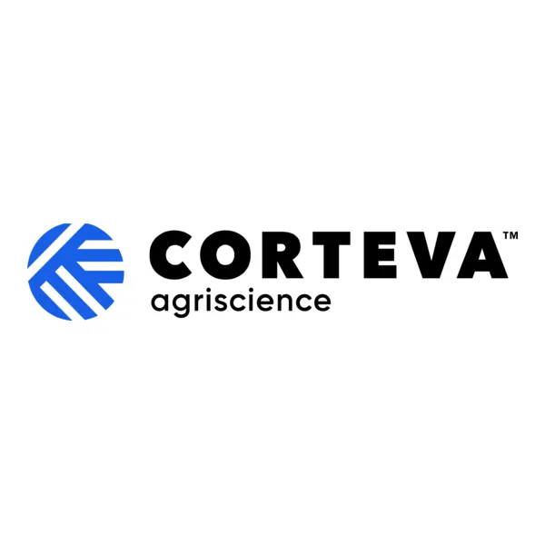

  

 

# Documentação Técnica: Calculadora Pecuarista

**Versão:** 1.0.0
**Data de Atualização:** 29 de Maio de 2026
**Confidencialidade:** Uso Interno / Propriedade Intelectual

---

## 1. Visão Geral do Sistema

A **Calculadora Pecuarista** é uma aplicação corporativa desenvolvida para estimar indicadores zootécnicos e financeiros em sistemas de pastejo rotacionado e lotação contínua. A ferramenta permite a entrada de parâmetros de forragem e categoria animal para processar, em tempo real, cálculos de capacidade de suporte, taxa de lotação, GPD (Ganho de Peso Diário) e projeções de faturamento e lucro.

O sistema foi arquitetado primariamente como um *Progressive Web App* (PWA) e migrado para uma infraestrutura na nuvem garantindo segurança, escalabilidade e conformidade.

---

## 2. Arquitetura de Software

A infraestrutura utiliza o paradigma *Serverless* e *Edge Computing*, operando sob a seguinte stack tecnológica:

*   **Frontend / Interface:** React.js 18 + Vite.
*   **Linguagem:** TypeScript (Strict Mode).
*   **Estilização:** TailwindCSS (Design System).
*   **Backend / DB:** Supabase (PostgreSQL 15).
*   **Hospedagem:** Vercel.
*   **Gerador de Relatórios:** jspdf / jspdf-autotable.

### 2.1. Funcionalidades Principais
1.  **Simulador Matemático:** Execução em tempo real de cálculos baseados em parâmetros do pasto.
2.  **Exportação Oficial:** Geração de relatórios PDF homologados contendo os cenários simulados.
3.  **Gestão de Sessão (Auth):** Controle de acesso baseado em links mágicos e códigos de acesso (OTP), eliminando atritos com senhas complexas.
4.  **Histórico em Nuvem:** Rastreamento persistente de simulações com mapeamento restrito por e-mail, utilizando RLS (*Row Level Security*).

---

## 3. Banco de Dados e Segurança Estrutural

O sistema migrou do armazenamento estritamente local (IndexedDB) para um ecossistema centralizado no **Supabase**. A arquitetura foi desenhada para resistir a inconsistências de payload, contendo validações diretas no banco de dados.

### 3.1. Esquema da Tabela `calculations`

A tabela raiz foi estruturada para comportar de forma padronizada os *inputs* e *outputs* das sessões de cálculo.

**Colunas e Restrições (Constraints):**
*   **Chaves e Controle:** `id` (UUID V4), `user_id` (Auth Reference), `user_email` (Text), `created_at`, `updated_at`.
*   **Dados da Propriedade:** `farm_name`.
*   **Parâmetros de Entrada:**
    *   `sample_area` (numeric, > 0)
    *   `sample_weight` (numeric, >= 0)
    *   `dry_matter_percent` (numeric, 0 a 100)
    *   `forage_supply_percent` (numeric, 0 a 100)
    *   `paddock_count` (integer, > 0)
    *   `occupation_days` (integer, > 0)
    *   `category` (ENUM: Bezerro, Novilha, BoiGordo, VacaCria, VacaSeca)
    *   `body_weight` (numeric, > 0)
    *   `gpd` (numeric, >= 0)
    *   `unavailability_percent` (numeric, 0 a 100)
    *   `price_per_arroba` (numeric, >= 0)
    *   `pasture_area` (numeric, > 0)
    *   `area_unit` (ENUM: ha, alq_sp, alq_mg)
*   **Parâmetros de Saída (Outputs):** `forage_mass`, `support_capacity`, `stocking_rate_ua`, `stocking_rate_ua_ha`, `stocking_rate_heads`, `stocking_rate_heads_ha`, `productivity`, `revenue`, `profit`.

### 3.2. Políticas de Segurança (RLS - Row Level Security)
O banco restringe de forma draconiana o acesso aos dados:
1.  **Leitura:** `auth.uid() = user_id` (Usuários visualizam estritamente os cálculos atrelados ao seu token JWT).
2.  **Escrita:** `auth.uid() = user_id` (Apenas o próprio titular do *token* tem autorização para realizar a inserção de `INSERT`).
3.  **Exclusão:** `auth.uid() = user_id`.

### 3.3. Sistema de Anti-Hibernação (pg_cron)
Para mitigar as políticas de "Pause" de projetos gratuitos da plataforma Supabase, foi implementado nativamente no banco de dados um gatilho de *Keep-Alive* utilizando a extensão `pg_cron` e `pg_net`. O banco envia requisições à própria API REST em janelas de 12 horas, burlando efetivamente a inatividade.

---

## 4. Modelagem Matemática e Lógica de Negócio

A camada de serviço localizada em `src/utils/calculator.ts` encapsula a lógica zootécnica.

### 4.1 Fatores de Conversão de Área
O aplicativo abstrai a conversão automática para as métricas mais utilizadas no território nacional:
*   Hectare (ha) = `1.0`
*   Alqueire Paulista (alq_sp) = `2.42` ha
*   Alqueire Mineiro (alq_mg) = `4.84` ha

### 4.2 Lógica do Cálculo Principal
A *Massa de Forragem* em kg MS/ha é obtida por:
`MassaForragem = (sampleWeight * (dryMatterPercent / 100) * 10000) / sampleArea`

Capacidade de suporte estática (UA/ha) considera o tempo global de pastejo:
`CicloTotal = occupationDays + growthPeriod`
`ConsumoCiclo = ((bodyWeight * 1.22) * (forageSupplyPercent / 100)) * CicloTotal`

Onde `1.22` é o fator matemático indexador da UA base de 450kg (Peso Animal / 450 * Equivalência Zootécnica).

---

## 5. Deployment e Integração Contínua (CI/CD)

O código fonte está espelhado no GitHub. Todo `push` efetuado no ramo `main` trigga automaticamente a esteira de CI/CD da **Vercel**.

1.  **Build Phase:** O *Vite* empacota e otimiza as *assets*, construindo um bundle *Rollup* de altíssima performance.
2.  **Environment Variables:** Credenciais sigilosas (`VITE_SUPABASE_URL`, `VITE_SUPABASE_ANON_KEY`) encontram-se trancadas no cofre de variáveis de ambiente do painel da Vercel. Não devem, sob hipótese alguma, ser expostas no código de controle de versão.
3.  **Edge Routing:** Todo o roteamento é servido através da CDN Global da Vercel, proporcionando latências inferiores a 50ms para a entrega primária da casca da PWA.

---

**Fim da Documentação**
